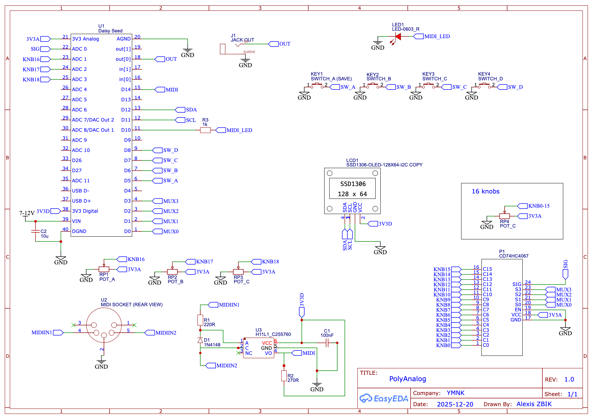

# PolyAnalog

## Overview

**PolyAnalog** is a 4-voice polyphonic Analog synthesizer based on the **Daisy Seed** microcontroller.

---

## Features

- 4-voices polyphony  
- MIDI input
- mono audio output
- 2 VCO with SuperSaw, Saw, Square with pulse width modulation
- Mix between the 2 VCO
- -2 -> +2 octaves per VCO (second vco can also have fifth tuning and fine tuning around 0)
- Glide
- White Noise
- ASR envelope
- Low pass filter with envelope and resonance
- global High pass
- Volume 
- 2 LFOs with destination choice
- 16 presets save & load, compatible with Program Change  
- OLED display (SSD1306 128×64)
- mod wheel for vibration, and pitch-bend with 2 semitones (might be editable in the future)

The synth is locked on MIDI Channel 5, this might be editable in the future.

---

## MIDI CC Mapping

| CC | Target |
|---:|---|
| 1 | Mod Wheel |
| 10 | PlayMode |
| 11 | Glide |
| 12 | Volume |
| 13 | OscWaveformA |
| 14 | OscOctaveA |
| 15 | OscWaveformB |
| 16 | OscTuneB |
| 17 | OscNoise |
| 18 | OscMix |
| 19 | FilterCutoff |
| 20 | FilterRes |
| 21 | FilterEnv |
| 22 | Attack |
| 23 | Decay |
| 24 | Sustain |
| 25 | HighPass |
| 26 | LfoTypeA |
| 27 | LfoDestinationA |
| 28 | LfoRateA |
| 29 | LfoAmountA |
| 30 | LfoTypeB |
| 31 | LfoDestinationB |
| 32 | LfoRateB |
| 33 | LfoAmountB |

---

## Knob Soft Takeover

After loading a preset, knobs are "caught" to avoid jumps.

- Turning a knob does not jump immediately to its physical position.
- While locked, movement is applied with a ratio between current knob travel and stored preset value (progressive catch-up).
- It unlocks when you pass through the stored preset value.
- It also unlocks if you turn all the way down or all the way up.
- Once unlocked, it behaves normally again.

---

## Schematic



---

## Bill of Materials (BOM)

- 1× Daisy Seed  
- 1× CD74HC4067 multiplexer  
- 19× 10kΩ potentiometers  
- 1× Audio output jack  
- 1× MIDI input  
- 1× H11L1 optocoupler  
- 1× LED  
- 1× 1kΩ resistor (LED current-limiting, adjust depending on LED color and brightness)  
- 1× 220Ω resistor  
- 1× 270Ω resistor  
- 1× 100nF capacitor  
- 4× Normally Open (NO) push buttons* 
- 1× OLED screen SSD1306 (128×64)  

---

## Flashing the Microcontroller

First, clone this repository **including all submodules**:

```bash
git clone --recurse-submodules https://github.com/alexiszbik/PolyFM.git
```

To flash the Daisy Seed, please refer to the official Daisy documentation:

https://daisy.audio/

Go to Software → C++ → Tutorials and follow the instructions to install the toolchain and flash the firmware.
